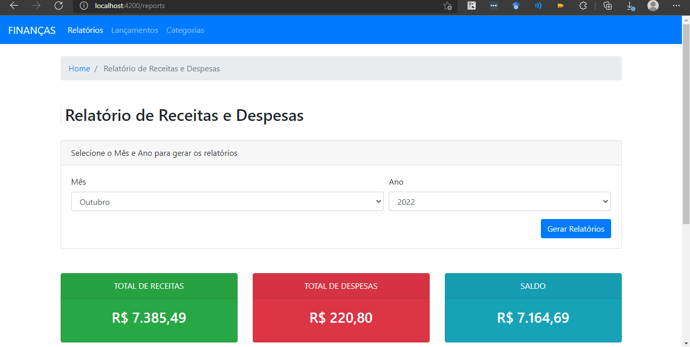
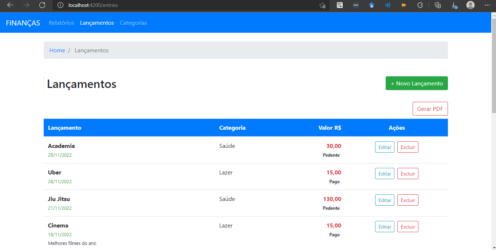
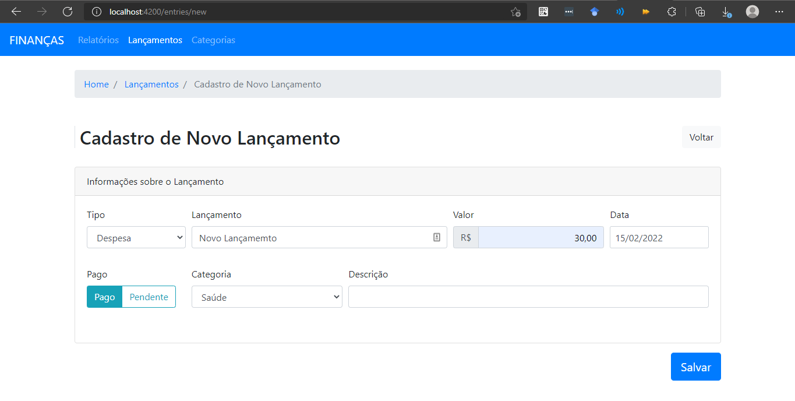
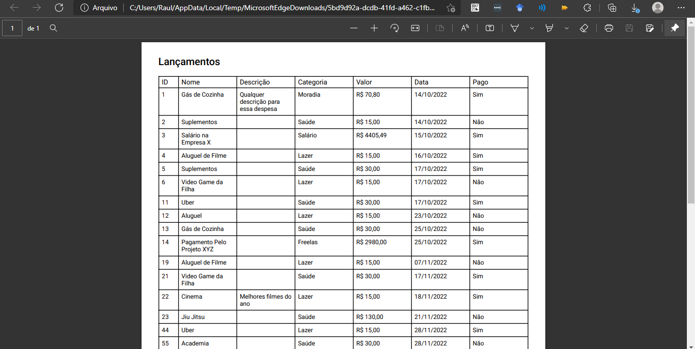
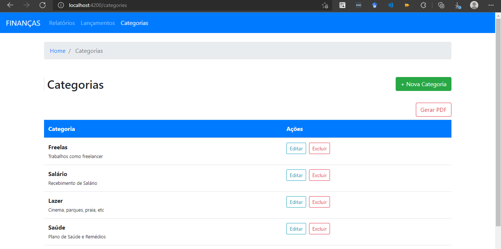

# Sistema de Finanças
O sistema faz cadastro de categorias e lançamentos. Cada lançamento possui uma determinada categoria. Além disso, é possível gerar um arquivo PDF contendo a lista de todas categorias ou lançamentos. Também é possível visualizar por meio de um gráfico, as despesas, receitas e saldo de um determinado mês do ano.

## Tecnologias utilizadas
* Angular 12 com TypeScript

## Arquitetura utilizada
O projeto utiliza a arquitetura Master Details, no qual tem como principal objetivo a generalização das classes, o qual as tornam reutilizáveis, evitando duplicação de código no sistema. No projeto é encontrado CRUD genérico, classe de serviços genérica, componentes reutilizáveis na aplicação, além da classe geradora do PDF (biblioteta pdfmake) também ser genérica.

## Layout do sistema

# Frontend

This project was generated with [Angular CLI](https://github.com/angular/angular-cli) version 7.3.10.

## Development server

Run `ng serve` for a dev server. Navigate to `http://localhost:4200/`. The app will automatically reload if you change any of the source files.

## Code scaffolding

Run `ng generate component component-name` to generate a new component. You can also use `ng generate directive|pipe|service|class|guard|interface|enum|module`.

## Build

Run `ng build` to build the project. The build artifacts will be stored in the `dist/` directory. Use the `--prod` flag for a production build.

## Running unit tests

Run `ng test` to execute the unit tests via [Karma](https://karma-runner.github.io).

## Running end-to-end tests

Run `ng e2e` to execute the end-to-end tests via [Protractor](http://www.protractortest.org/).

## Further help

To get more help on the Angular CLI use `ng help` or go check out the [Angular CLI README](https://github.com/angular/angular-cli/blob/master/README.md).
